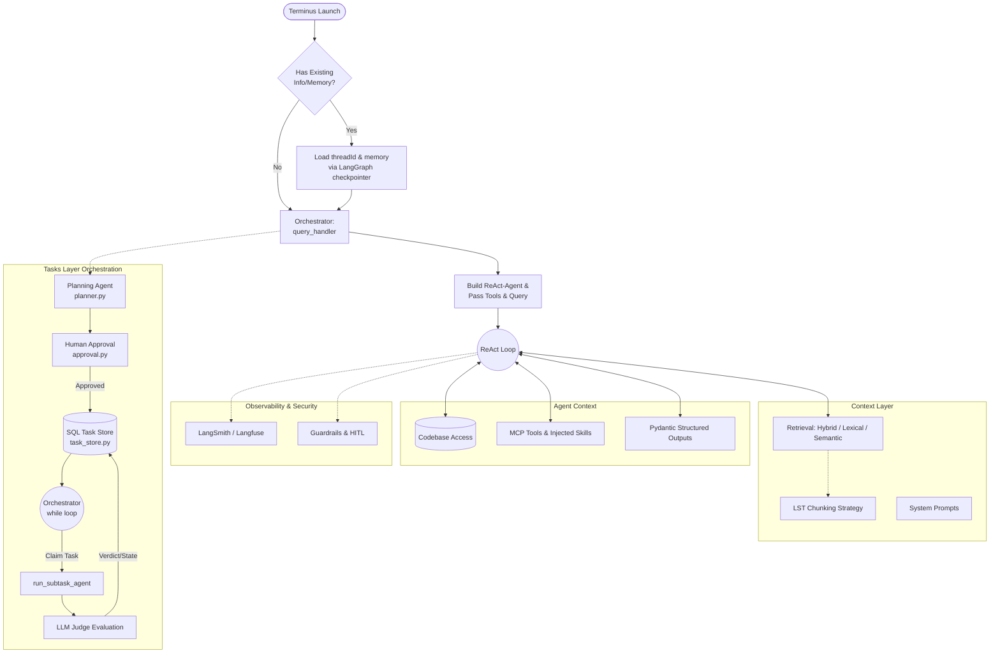

# Terminus

Terminus is a CLI tool that lets you ask natural-language questions about a codebase. It ingests a repository, builds a semantic vector index over the source code, and answers questions through an LLM agent equipped with a code-search tool.

## Status

- Semantic indexing and retrieval pipeline: **implemented**
- Agent orchestration (LangChain `create_agent` + tool-calling loop): **implemented**
- Multi-provider LLM support (Fireworks, OpenAI, Cerebras, Anthropic): **implemented**
- Hybrid retrieval (semantic + exact/lexical lookup): **planned**
- Build-artifact exclusion from indexing (`.egg-info`, `SOURCES.txt`, etc.): **planned**

## Features

- **Codebase ingestion** — walks a repository, splits source code into ast nodes and embeds them into a persistent Chroma vector store.
- **Semantic search tool** — a `search_codebase` tool backed by the vector index, exposed to the agent via `create_retriever_tool` / a custom retrieval wrapper.
- **Conversational CLI** — a REPL (`/ask`, `/clear`, `/help`, `/show_semantic_index`, `/exit`) for querying the indexed codebase.
- **Lazy agent construction with caching** — the agent is built once, on first query, and reused for the session (`handle_query` in `orchestrator.py`).
- **Configurable LLM backend** — provider and model are chosen via `config.yaml` and resolved at runtime by `llm/factory.py`, with support for:
  - Fireworks (`FIREWORKS_API_KEY`)
  - OpenAI (`OPENAI_API_KEY`)
  - Cerebras (`CEREBRAS_API_KEY`)
  - Anthropic (`ANTHROPIC_API_KEY`)
- **Call-budget middleware** — `ModelCallLimitMiddleware` and `ToolCallLimitMiddleware` cap how many model calls and `search_codebase` calls a single query can consume, so a query fails fast instead of looping indefinitely.
- **Model Context Protocol (MCP) Integration** — seamlessly connects to local or remote MCP servers (via `terminus_mcp_servers.json`) to dynamically equip the agent with advanced tools (e.g., filesystem operations, GitHub interactions).
- **Goal-Focused Skills System** — allows for manual ingestion of task-specific instructions ("skills") that guide the agent on how to handle specialized domains.

## Advanced Capabilities

### Model Context Protocol (MCP) Integration

Terminus integrates with external Model Context Protocol (MCP) servers to vastly expand its toolset. MCP connections are defined in a `terminus_mcp_servers.json` file. For example, an MCP server can provide advanced filesystem access or GitHub integrations via `stdio` transport. Terminus dynamically connects to these servers at runtime, fetches their available tools, and seamlessly provides them to the LangChain agent.

### Task-Specific Skills System

To make the agent more goal-focused and context-aware, Terminus supports manual ingestion of "skills". 

Here is how the skills ingestion is done manually for understanding purposes:
1. **Directory Structure:** Skills are placed in a specific directory (e.g., `.terminus/skills/`). Each skill gets its own folder (like `frontend-design`).
2. **SKILL.md File:** Inside each folder is a `SKILL.md` file that defines the skill.
3. **Metadata (Frontmatter):** The file starts with a YAML frontmatter block containing metadata such as `name`, `description`, and `when_to_use`.
4. **Body (Instructions):** Below the frontmatter are the actual markdown instructions, guidelines, and context that the LLM should follow for that specific task.
5. **Dynamic Loading:** At startup, the `SkillRegistry` parses these `SKILL.md` files. It extracts the metadata and appends a summary of available skills to the agent's system prompt. When the agent recognizes that a user's request aligns with a skill, it calls the `load_skill` tool to retrieve the full body instructions and execute the task accordingly.

## Architecture

Terminus is designed with a layered architecture, allowing it to use hybrid, lexical, or only semantic retrieval based on configuration. 

### Core Architectural Layers
- **Context Layer:** Includes the retrieval and indexing layer of the codebase, the memory layer, and some system prompts. The chunking strategy is done using LST via a library, because code is simply different than text. 
- **Agent Orchestrator:** The `query_handler` from the Orchestrator manages queries, handles building agents, and passes tools and queries to them. The default agents are ReAct-agents (which means they are constantly in a reasoning-act loop until they deem it well). The agent ideally has access to all codebase and tools to perform tasks.
- **Tooling & Skills:** MCP tools are used wherever possible for much more efficient performance of tasks. Ideally, skills could be added in the end-user project, injected directly by Terminus scripts, and loaded as tools for the agent to use whenever required.
- **Memory Layer:** Memory has been implemented using the checkpointer of LangGraph (e.g., maintaining `threadId`).
- **Observability Layer:** Currently handled by LangSmith itself, with potential exploration of Langfuse.
- **Security Layer:** Guardrails and Human-In-The-Loop (HITL) workflows would be used.
- **Determinism:** Pydantic Structured Outputs are used wherever determinism is required.
- **Tasks Layer Orchestration:** A long-running deep-agents orchestrator (`orchestrator.py`) handles execution. It starts with a planning phase where an agent (`planner.py`) creates a comprehensive execution plan. This plan is sent to the user via a Human-In-The-Loop (HITL) system (`approval.py`) for review and modification. Once approved, the orchestrator persists the tasks in a SQL-based `task_store` under a `project_id`. The orchestrator's `while` loop then solves tasks via agents in a sorted directed graph (DAG) fashion—claiming them one by one in the executor. Independent tasks run in parallel, while dependent tasks wait for their parent dependency results before being sent to `run_subtask_agent`. Finally, each completed task is evaluated by an LLM as a judge for a final verdict on success.

```text
terminus/
├── cli.py                     # REPL entry point (/ask, /clear, /help, /show_semantic_index)
├── config.py                  # loads config.yaml into CONFIG
├── agent/
│   ├── factory.py             # builds the LangChain agent (LLM + tools + system prompt + middleware)
│   ├── orchestrator.py        # handle_query(): lazy agent build + cache + invoke
│   └── tools.py                # search_codebase tool: formats retrieved chunks for the agent
├── context/
│   ├── indexers/
│   │   └── semantic_chroma.py # builds/updates the Chroma index from source files
│   └── retrievers/
│       └── semantic_chroma.py # retrieve(): embeds a query and returns top-k Chroma matches
├── llm/
│   └── factory.py             # get_llm(): resolves provider/model from CONFIG
└── observability/
    └── logging.py              # structured logging
```

### System Flow



**Request flow:**

1. **Launch:** Terminus will launch up with all existing info if it had done earlier, such as current `threadId` or any memory-related stuff.
2. **Orchestration:** Otherwise, the query will be managed by `query_handler` from Orchestrator, which handles building agents and passing tools and the query to it.
3. **Execution:** The agent (a ReAct-agent in a reasoning-act loop) utilizes available tools, injected skills, and full codebase access to perform the task.
4. **Context Retrieval:** Information is retrieved via configurable layers (hybrid, lexical, semantic) backed by LST-chunked data.
5. **Planning & Approval:** For larger workflows, a planning agent creates an execution plan, which is presented to the user for approval or modification (HITL).
6. **Task Orchestration:** Approved plans are stored as a project in a persistent SQL `task_store`. An orchestrator `while` loop manages state, claiming ready tasks in a DAG order (resolving dependencies first).
7. **Execution & Evaluation:** Each task is sent to `run_subtask_agent`. Upon returning, an LLM judge evaluates the result. The task store is updated, and the orchestrator continues until all project tasks are completed.

## Configuration

LLM provider and model are set in `config.yaml`:

```yaml
llm:
  provider: fireworks   # fireworks | openai | cerebras | anthropic
  model: kimi-k3
```

Set the matching API key as an environment variable (e.g. `FIREWORKS_API_KEY`) via a `.env` file or your shell.

The embedder is fixed to `sentence-transformers/all-MiniLM-L6-v2` via HuggingFace.

## Usage

```bash
terminus
```

Commands inside the REPL:

| Command | Description |
|---|---|
| `/ask <question>` | Ask a question about the indexed codebase |
| `/show_semantic_index` | Show stats about the current semantic index |
| `/clear` | Clear the screen |
| `/help` | Show available commands |
| `/exit`, `/quit` | Exit the CLI |

## Evaluation Notes: Semantic Retrieval + Model Behavior

The semantic indexing and retrieval pipeline has been implemented and evaluated against multiple LLM backends before moving on to a hybrid retrieval architecture. The findings below summarize that evaluation.

### Retrieval quality

Retrieval performs well for **behavioral / descriptive queries** ("how does the agent get built?", "how is the LLM provider selected?", "how does the CLI handle the /ask command?") — these consistently return the correct source chunk in the top results, regardless of which LLM is used.

Retrieval performs poorly for **filename-style queries** ("orchestrator.py", "where is orchestrator.py?", "what does orchestrator.py do?"). In these cases, packaging/build metadata files (`SOURCES.txt`, `entry_points.txt`, `top_level.txt`, `PKG-INFO` under `.egg-info/`) tend to win the top-k slots over the actual source file, because they contain the literal filename as text while the source file itself does not. This is a known indexing gap, not a fundamental limitation of semantic search — excluding build artifacts from the index is expected to resolve it, and is planned as part of the hybrid retrieval work (adding an exact/lexical filename-match path alongside semantic search).

### Model comparison: gpt-oss-120b vs. kimi-k3

With an identical embedder, identical index, identical system prompt, and identical middleware limits, the two models diverged sharply in tool-use discipline:

> What was observed while testing is that models like gpt-oss-120b take more tool calls and model calls for a semantic search, whereas a model like kimi-k3 takes fewer model calls and tool calls for the same semantic search, using the same embedding model.

To test whether this was simply a matter of budget, the model-call and tool-call limits were deliberately increased to see whether gpt-oss-120b could perform closer to kimi-k3 given more room:

> The budget increase didn't help; it just delayed the same failure by exactly the amount added. With the old limit of 2 tool calls, gpt-oss-120b failed at 3. With the limit raised to 4, it failed at 5. That's not "it needed more room"; it's that the model will always use every call available, regardless of the quality of what it already has. A model that is actually judging sufficiency would stop earlier on at least some queries once it hit a good chunk. gpt-oss-120b never did; a 0% self-stop rate was observed across every multi-call case tested, on two separate call budgets.

By contrast:

> Compared directly against kimi-k3 on the identical prompt, identical limits, and identical index: kimi-k3 stopped at 2 of 4 available calls on the hardest query tested ("what does orchestrator.py do?") and returned a structured, honest answer distinguishing what it could confirm from what it could not. gpt-oss-120b, on an easier query, used its entire call budget and returned nothing but a limit-exceeded error.

An additional observation from earlier, unbounded runs:

> Without middleware limits in place, models like gpt-oss-120b were observed making a much larger number of tool calls and model calls for a single semantic search. With middleware limits applied, this behavior is instead forced to fail cleanly within a bounded range rather than looping indefinitely.

Some queries still fail on **both** models under semantic-only retrieval (primarily the filename-style queries described above). This is expected to be fixed by the planned hybrid retrieval architecture, but the semantic-only baseline needed to be properly evaluated on both models first, which this round of testing accomplished.

### Conclusion

> It has been concluded that increasing the model-call and tool-call limits still does not produce as good a result as simply using a better-behaved model. Increasing the budget only delays failure; it does not change whether the model is judging retrieved context as sufficient.

Both Fireworks and Cerebras are used as LLM providers in this project — not because either is required architecturally, but specifically to test multiple models against multiple embedding setups and identify which combinations perform best. The overall architecture and design choices aim to get reliable results even with the lowest-cost/lowest-capability models feasible; where that isn't achievable (as with gpt-oss-120b's tool-use discipline in this evaluation), a stronger model such as kimi-k3 is used instead.

## Roadmap

- [ ] Exclude `.egg-info/`, `SOURCES.txt`, `PKG-INFO`, `entry_points.txt`, `top_level.txt`, `dependency_links.txt`, `requires.txt` from indexing.
- [ ] Add an exact/lexical filename-match path as a second retrieval tool, to complement semantic search for "where is file X" style queries.
- [ ] Implement hybrid retrieval (semantic + lexical) and re-evaluate against both gpt-oss-120b and kimi-k3.
- [ ] Re-run the full query test suite after the indexing fix to confirm filename-style queries resolve correctly.